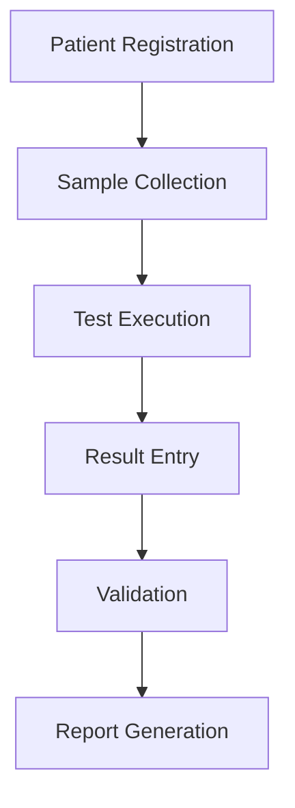

# Healthcare LIMS Testing Project
A comprehensive QA testing portfolio for a Laboratory Information Management System (LIMS) in the healthcare domain.

## 🎯 What This Project Demonstrates
- End-to-end functional testing in healthcare software
- Business workflow validation across patient registration, sample collection, analysis, and reporting
- Cross-functional data dependency analysis
- Risk-based testing methodologies for medical systems
- Domain expertise in healthcare IT and compliance (simulated)
- System behavior verification under exceptions
- Professional QA documentation and defect investigation practices

## 📦 Modules Included
### 1. Patient & Sample Management
- Patient Registration
- Sample Collection & Barcoding
### 2. Analysis & Results
- Test Execution
- Result Entry & Validation
### 3. Reporting
- Medical Report Generation
- Approval Workflows

## 📸 System Architecture Diagram (Mermaid)

